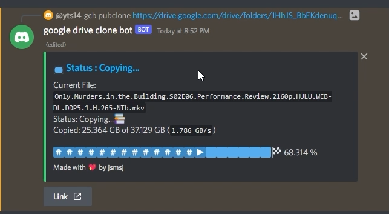
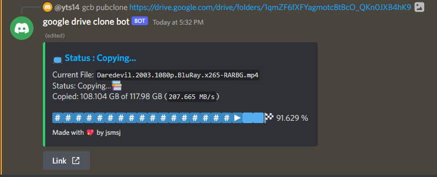
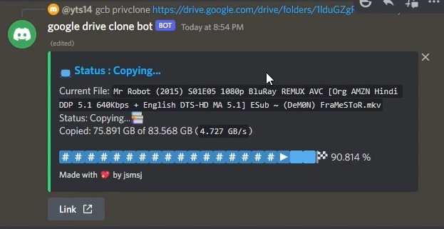
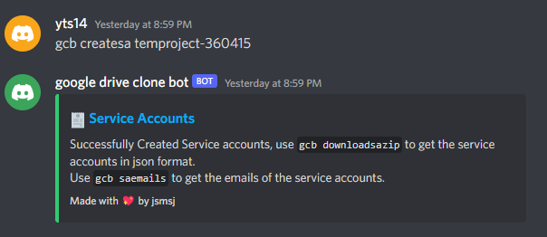
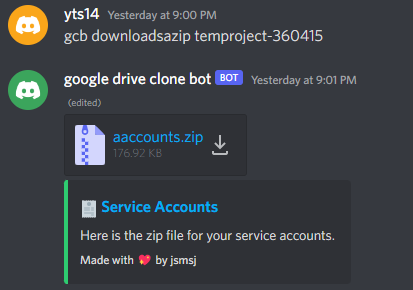
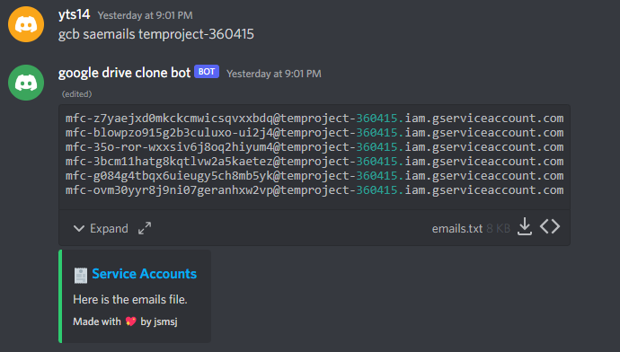

# Not a mirror bot
###### Now that being out of the way, lets start:
---
## What is it ?

This is a clone bot, which clones google drive urls, to your own Teamdrive or Personal Google Drive.

## How it works ?

The bot requires your google drive authentication to clone the files to which you have access. It also clones public google drive links, moreover you can add your service accounts, to increase the limit of cloning public urls

# How to deploy ?

## Main video [Includes heroku deployment]

> If the video is slow for you, watch in 2x speed.

## Host locally
[Read Guide](docs/Host%20Locally.md)

## Host on railway.app
[Read Guide](docs/Host%20on%20Railway.md)

## Features:

### Clone google drive links
- Continue reading to see which links can the bot clone
- Shows you the current speed by which it clones as well as the file it is cloning
- add ETA and size of current file etc, see [TODO](TODO)

### Service Accounts
- Features a `quickstart` command for the newbies to quickly generate 100 service accounts.
- Featues commands like `saemails` , `downloadsazip`, `createsas` etc. which enables users to downlad that emails.txt file (those who know, know), download zip file of service accounts and even create service accounts for a given project id.

### Database
- Has a mongodb database, which stores service accounts and their emails, so that the bot doesn't ping the google api everytime it uses them. [because for a given project, google api only allows the service account to be downloaded 10 times.]
- Also used to store the default location for cloning (changable via `set_folder` command.)

## Which links can it clone ?

| From  | To  | Can Clone ?  | Using S.A. | Limit  | Bot Command |
| ------------ | ------------ | ------------ | ------------ | ------------ | ------------ |
| Public Url (**everyone has access**)  | Public/Private folder (**you have uploading access** but S.A. do not)  | yes  |no| 750GB  |`prefix privclone`|
|  Public Url (**everyone has access**) |  Public/Private folder (**S.A. have uploading access**) | yes  |yes| (750 x no. of S.A.) GB  |`prefix pubclone`|
|  Public Url (**everyone has access**) |  Public/Private folder (neither have uploading access) | no  |-| -  |-|
| Private Url** (**you have access**)  | Public/Private folder (**you have uploading access** but S.A. do not)  | yes  |no| 750GB  |`prefix privclone`|
|  Private Url (**S.A. have access**) |  Public/Private folder (**S.A. have uploading access**) |  yes |yes|  (750 x no. of S.A.) GB |`prefix pubclone`|
|  Private Url (you do not have access) |  Public/Private folder |  no |-|  - |-|
---

> `S.A.` stands for "Service Accounts"
> 
> All S.A. have access of public links (everyone can access)
> 
> ** For example you are a part of a teamdrive (but that teamdrive does not have your S.A.) and you need to clone a folder from it to your personal drive or teamdrive.
> 
> `no.` stands for "number of"
> 
> The Bot can clone to Teamdrive (Shared drive) if and only if you or your S.A. have uploading access.

## Images

---
### Cloning public links:
---

> Speed shown in brackets is the instantaneous speed of cloning

---
### Cloning a private link
---

---
### Service Account Utilities
---

---

---

---

## Command specific videos:
- [quickstart](https://youtu.be/7PvR1MC_khI)
- [auth](https://youtu.be/fUKg5Ge2zl4)
- [authsa](https://youtu.be/rz59wScRrqE)
- [uploadsas](https://youtu.be/ofbelNADAtA)
- [pubclone](https://youtu.be/9dH121W0DZQ)
- [privclone](https://youtu.be/1eM3jXXJJtM)
- [set_folder](https://youtu.be/e1wqjROvc-I)
- [size](https://youtu.be/765uHC6Ybfk)
- [listprojects, createsa, downloadsazip, saemails](https://youtu.be/hWmX-a22uLA)

---

# DM open for recommendations > Discord: jsmsj#5252

